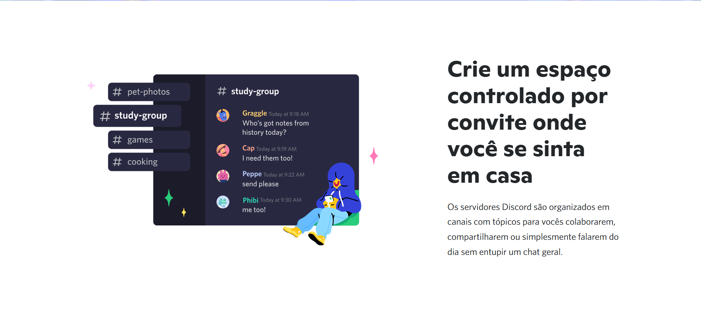
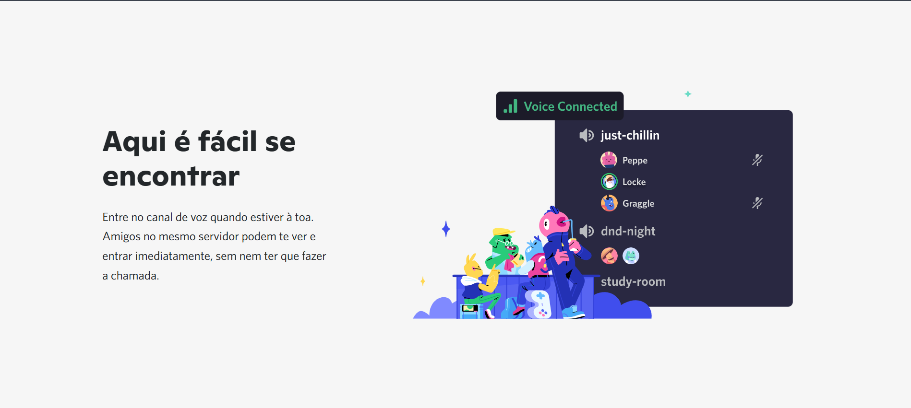
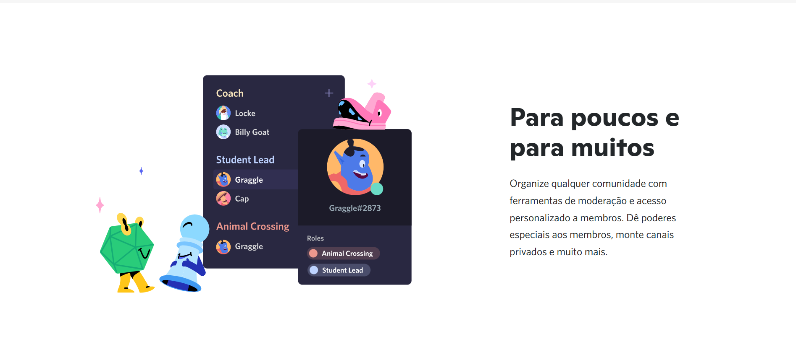
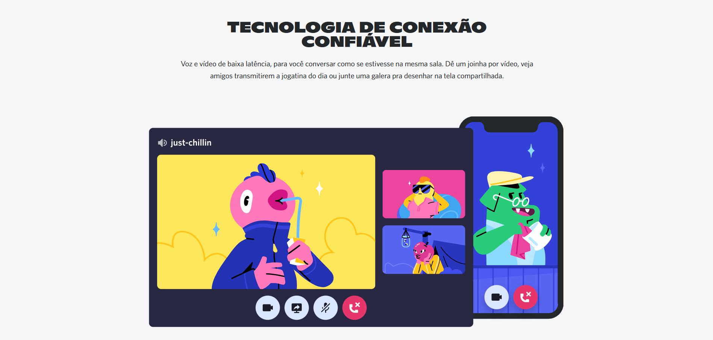
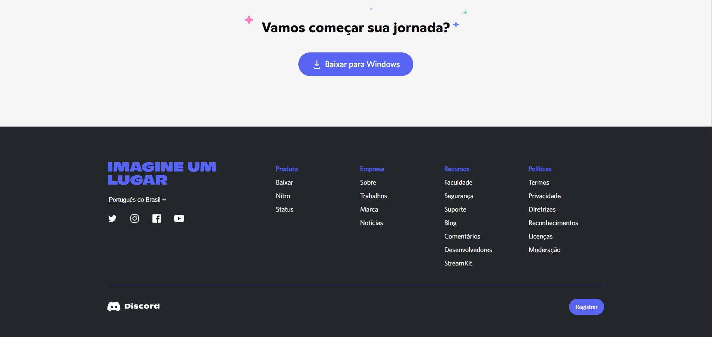

# Projeto Site de Discord
## Introdução
Em decorrência do meu avanço nos estudos e do aprimoramento das habilidades em desenvolvimento full-stack, decidi aprofundar meus conhecimentos na área de front-end por meio de um desafio prático. Para isso, foi desenvolvido um site inspirado na página oficial da plataforma de comunicação digital Discord, com o objetivo de reproduzir sua interface e aplicar conceitos de desenvolvimento web.

A implementação do projeto foi realizada de forma gradual, sendo inicialmente construída a estrutura da página utilizando HTML, seguida pela estilização com CSS e, por fim, pela implementação das funcionalidades e interações por meio de JavaScript. Tal abordagem facilitou a aplicação progressiva do conhecimento adquirido em meus estudos e trabalhos.

## Desenvolvimento da estrutura HTML 
Para realizar a estruturação da página, foi acessado o site oficial do Discord e, por meio da extensão Web Developer do Google Chrome, foram temporariamente desabilitados os estilos CSS e os scripts JavaScript. Com isso, foi possível visualizar a estrutura HTML da página de forma isolada, facilitando a análise da organização de seus elementos. A partir dessa estrutura e da referência visual fornecida pelo próprio site, o código HTML foi desenvolvido buscando reproduzir, da forma mais fiel possível, a disposição dos componentes presentes na página original. A maior parte do trabalho concentrou-se na organização dos botões interativos, imagens, textos informativos e demais elementos estruturais, respeitando a hierarquia e o posicionamento observados na interface do Discord.

De certa forma, a estrutura da página oficial é relativamente organizada e baseada na repetição de seções compostas por imagens, títulos, descrições e botões, o que facilitou sua reprodução utilizando os elementos semânticos do HTML. 

Para manter a organização do projeto, todos os recursos gráficos utilizados foram armazenados na pasta <i>img</i>, enquanto a estrutura da página encontra-se implementada no arquivo <i>site_discord.html</i>.

## Desenvolvimento da estilização com CSS

Na etapa de estilização, foram inicialmente criados dois arquivos CSS destinados ao carregamento das famílias tipográficas Whitney e Ginto Nord, utilizadas na identidade visual do Discord. A fonte Whitney é empregada predominantemente nos textos da interface, enquanto a Ginto Nord é utilizada em títulos e elementos de destaque, tendo sido incorporada ao site oficial após a reformulação de sua identidade visual em 2021. O carregamento dessas fontes foi realizado por meio da regra @font-face, permitindo que os arquivos de fonte fossem disponibilizados localmente e utilizados ao longo de todo o projeto. Os respectivos códigos encontram-se organizados na pasta <i>css</i>, nos arquivos <i>font.whitney.css</i> e <i>font.ginto.css</i>.

A estilização principal da página foi implementada no arquivo <i>style.css</i>, responsável por definir a aparência da interface como um todo. Nesse arquivo foram especificados aspectos visuais como paleta de cores, tipografia, dimensões, espaçamentos, posicionamento dos elementos, organização do layout por meio de Flexbox e CSS Grid, além da implementação da responsividade utilizando media queries. Dessa forma, foi possível reproduzir uma interface visualmente semelhante à do site oficial do Discord, mantendo uma estrutura organizada e adaptável a diferentes resoluções de tela.

## A etapa final: o desenvolvimento das funcionalidades com JavaScript

Inicialmente, o script aguarda o carregamento completo da página (window.onload) para iniciar a execução das demais rotinas. Nesse momento, são carregados automaticamente a folha de estilos principal (style.css) e o ícone da página (favicon), além da inicialização da estrutura da interface. Grande parte da implementação utiliza a manipulação da DOM (Document Object Model) para criar, organizar e inserir elementos HTML de forma dinâmica. Para isso, foram desenvolvidas funções auxiliares que automatizam a criação de componentes e sua distribuição entre as diferentes seções da página, como cabeçalho, barra de navegação, artigos, área de download e rodapé. O código também emprega padrões de projeto, como Factory Pattern e Builder Pattern, permitindo centralizar a criação dos elementos da interface, reduzir a repetição de código e facilitar a manutenção da aplicação.

Outra funcionalidade implementada consiste na adaptação da página à resolução da tela. O script verifica continuamente a largura da janela do navegador e, caso ela seja inferior à resolução mínima estabelecida (1280 pixels), substitui temporariamente o conteúdo da página por uma mensagem informando que a resolução não é suportada. Quando a largura retorna ao valor mínimo exigido, a interface original é restaurada automaticamente. Além disso, o JavaScript identifica o sistema operacional do usuário por meio do navegador e altera dinamicamente o texto do botão de download, exibindo mensagens como "Baixar para Windows", "Baixar para Linux" ou "Baixar para Mac", tornando a interface mais próxima do comportamento observado no site oficial do Discord.

Por fim, o código realiza a organização automática das seções da página, distribuindo imagens, títulos, descrições, menus e demais componentes em seus respectivos locais, aplicando classes CSS específicas que controlam o layout, o posicionamento e a alternância visual entre as diferentes seções do site.

## O resultado final

<figure>
  <figcaption>Topo da página</figcaption>
</figure>

<figure>
  <figcaption></figcaption>
</figure>

<figure>
  <figcaption></figcaption>
</figure>

<figure>
  <figcaption></figcaption>
</figure>

<figure>
  <figcaption></figcaption>
</figure>

<figure>
  <figcaption></figcaption>
</figure>
